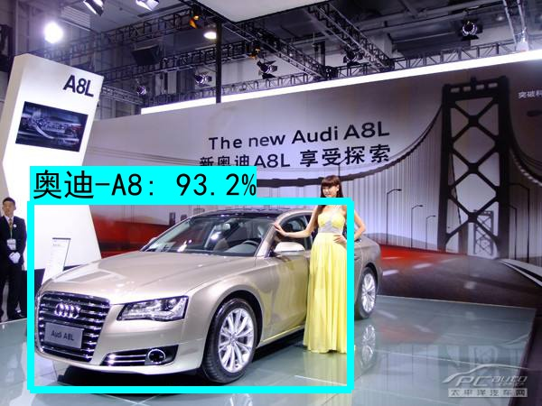
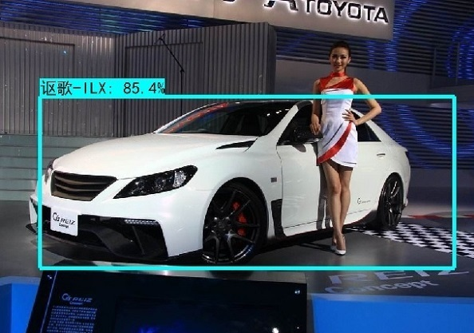
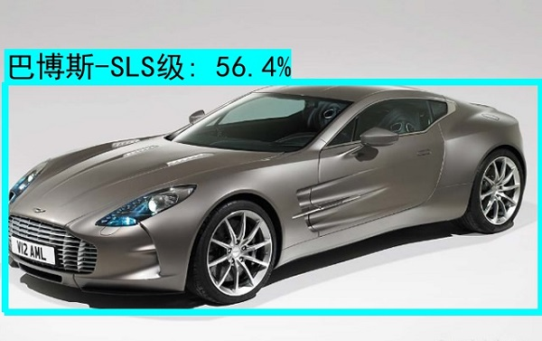

# 车辆型号识别
#### 通过在停车场出入口、路口、高速卡口等位值对车辆的数量及型号进行识别，可以高效的对车辆信息进行采集。通过采集的数据，在不同的场景中可以辅助不同的业务开展。如商场停车位的规划、路况规划，或者公安系统追踪肇事车辆等，适用于智能交通、自动驾驶、安防等领域，应用前景广阔。本项目使用Inception V4神经网络训练车辆数据集，生成分类训练模型，然后用分类训练模型对图片中的车辆型号进行识别。

## 1 &nbsp;算法
##### 分类模型采用Inception V4卷积神经网络，Inception V4融合了Inception Module优良的网络结构，和Residual Connection训练极深网络的残差学习模块，集两个方向之长，具有较高的分类准确率。在tinymind上运行程序，通过优化学习率等参数，最终得到在验证集上的分类准确率是88.4%。

## 2 &nbsp;结果 
##### 从训练结束的检查点文件，冻结参数生成含有权重参数的图协议文件vehicle_inception_v4.pb。用此训练模型生成的图协议文件可以实现对任意图片中的车辆型号进行识别。车辆型号识别过程和主要代码如下：
##### 1) 首先加载图协议文件，读取车辆型号标签。
    classify_graph = tf.Graph()
    with classify_graph.as_default():        
        with open('./vehicle_inception_v4_freeze.pb', 'rb') as f:
            graph_def = tf.GraphDef()
            graph_def.ParseFromString(f.read())
            tf.import_graph_def(graph_def, name='')

    vehicle_label = {} 
    with open('./labels.txt' ,encoding='utf-8') as f:
        for item in f.readlines():
            item = item.strip().split(':')
            vehicle_label[int(item[0])] = {'id':int(item[0]),'name':item[1]}

##### 2) 读取图片,运行分类模型的图协议文件，得到分类预测结果。
    image_file = tf.read_file('./test_image.jpg')
    image = tf.image.decode_jpeg(image_file)
    image_np = np.expand_dims(image, axis=0)
    with classify_graph.as_default():
        with tf.Session(graph=classify_graph) as sess:
            image_input = sess.run(image_np)
            softmax_tensor = sess.graph.get_tensor_by_name('InceptionV4/Logits/Predictions:0')
            predictions = sess.run(softmax_tensor, feed_dict={'input:0': image_input})

##### 3) 预测准确率最大值的编号即对应车辆型号编号，通过车辆型号标签得到车辆型号名称。
    vehicle_accuracy = np.max(predictions,1)
    vehicle_idx = np.argmax(predictions,1)   
    vehicle_predict_name = []
    vehicle_predict_box = []
    for i,idx in enumerate(vehicle_idx):
        if vehicle_accuracy[i] > 0.3:
            vehicle_predict_name.append((str(vehicle_label[idx]['name']) + ': ' + '%.1f'%(vehicle_accuracy[i]*100) + '%'))
            vehicle_predict_box.append(vehicle_box[i])

##### 4) 在图片上标注识别出的车辆型号及准确率。    
     
        
    
